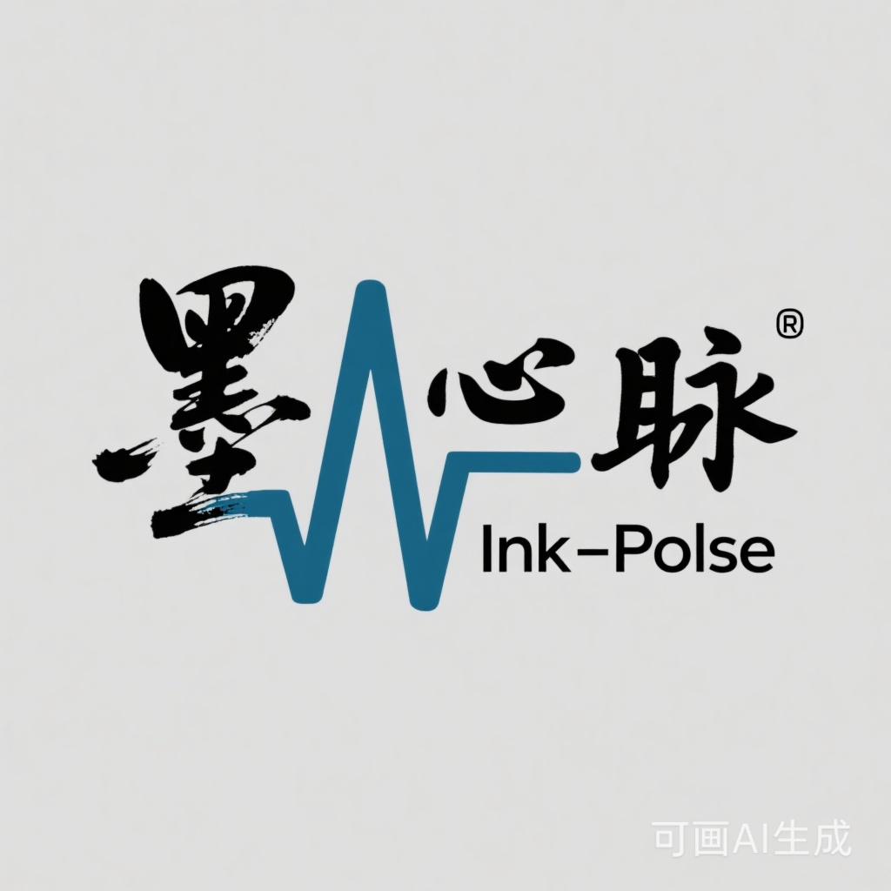
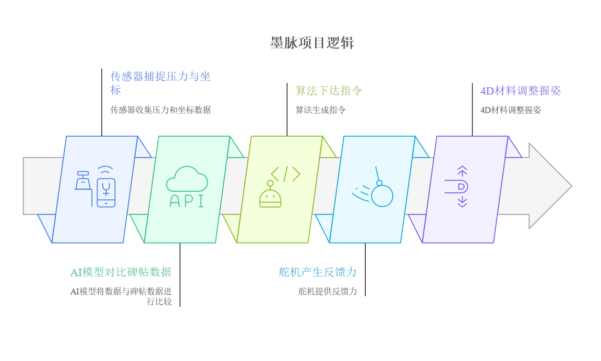
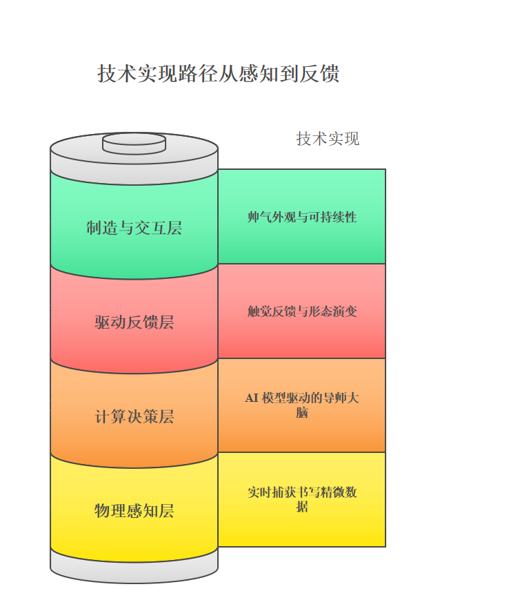

# 墨脉 (Ink-Pulse)：一支跨越 8 年的智能交互笔
> **从 2017 年的小学获奖征文，到 2025 年的跨学科原型探索**

## 📜 1. 缘起：儿时的发明家梦
[cite_start]本项目起源于我小学三年级时的一篇获奖征文《自动电子笔》[cite: 1]。
[cite_start]在那时，我幻想有一支能“教人写字、纠正姿势”的智能笔 [cite: 1]。8 年后的今天，作为浙大的学生，我尝试用自学的技术去回应这个童年的梦想。

---

## 📸 2. 视觉与成果展示 (Visual Showcase)

### 🎨 品牌与概念定调
| Logo 海报 | 成品实拍 |
| :---: | :---: |
|  |  |

### 🚀 概念效果预览

*注：利用 AIGC 工具进行的视觉表达探索，旨在呈现“赛博有机 (Cyber-Organic)”的设计美学。*

---

## 🎥 3. 功能演示 (Demo Clips)
*如果下方视频无法直接播放，请点击文字链接跳转查看*

| 辅助书写展示 | 4D材料效果展示 | 内部硬件结构 |
| :---: | :---: | :---: |
| <video src="成品笔辅助书写展示.mp4" controls width="250px"></video> | <video src="成品笔4D膨胀展示.mp4" controls width="250px"></video> | <video src="成品笔内部硬件展示.mp4" controls width="250px"></video> |
| [🔗 点击观看视频](成品笔辅助书写展示.mp4) | [🔗 点击观看视频](成品笔4D膨胀展示.mp4) | [🔗 点击观看视频](成品笔内部硬件展示.mp4) |

---

## 🧠 4. 设计逻辑与实现路径 (Design Logic)

通过“感知-决策-反馈”的闭环，我试图找回书写的“温度”：

1. [cite_start]**感知层 (Sensing)**：通过传感器捕捉压力与坐标精微数据 [cite: 36, 43]。
2. [cite_start]**决策层 (Decision)**：AI 模型对比名家碑帖风格矩阵，下达交互指令 [cite: 35, 45]。
3. **反馈层 (Feedback)**：
   - [cite_start]**触觉反馈**：舵机产生矢量推力，引导用户运笔 [cite: 7, 46]。
   - [cite_start]**形态进化**：4D 打印材料根据算法指令调整握姿，实现自适应人体工学 [cite: 9, 38]。

---

## 🛠️ 5. 技术栈与资源 (Resources)
- [cite_start]**三维建模**: SolidWorks (包含模型文件 `aaa.SLDPRT`) 
- [cite_start]**交互控制**: Arduino (基于 C/C++ 开发的底层逻辑 `sketch_feb9b.ino` / `sketch_feb9c.ino`) [cite: 16, 25]
- **项目文档**: [墨脉项目策划书.docx](项目策划书以及流程图ppt文案.docx) | [自动电子笔征文原文.txt](自动电子笔征文.txt)

---

## ✉️ 结语
这不仅是一个技术尝试，更是一个“初心落地”的过程。我渴望转入工业设计专业，在更专业的指导下，探索“算法赋能传统文化”的无限可能。

**设计者：董卓然** | **浙江大学 2025 级转专业申请材料**
